# 资产同步系统

自动化资产同步系统，定时从 Binance (加密货币) 和雪球 (基金) 获取价格和持仓数据，同步到 SQLite 和飞书多维表格。

## 快速开始

### 1. 安装依赖

```bash
# 使用 uv 管理环境
uv sync
```

### 2. 配置

编辑 `config.json`，配置以下信息：

- **飞书应用凭证**: `mcp_server.app_id` 和 `app_secret`
- **飞书表格**: `asset_sync.feishu.app_token` 和 `tables`
- **Binance API**: `asset_sync.binance.api_key` 和 `api_secret`
- **雪球 Cookies**: `asset_sync.xueqiu.cookies`
- **飞书机器人**: `asset_sync.alerts.feishu_webhook`

### 3. 初始化数据库

```bash
python setup_tables.py
```

### 4. 运行

```bash
# 测试运行 (一次性执行所有任务)
./main.py --run-once

# 启动定时服务
./main.py
```

---

## 系统架构

### 工作流程


### 数据流


---

## 核心功能

### 1. 自动资产发现

**加密货币**:
- 自动从 Binance 获取所有有余额的资产
- 支持 ignore 规则过滤 (通配符)

**基金**:
- 从飞书持仓表读取已有基金
- 支持 ignore 规则过滤

**Ignore 规则示例**:
```json
{
  "crypto": {
    "auto_discover": true,
    "ignore": ["USDT", "BNB", "*DOWN*", "*UP*"]
  }
}
```

- `"USDT"`: 精确匹配，忽略 USDT
- `"BNB*"`: 前缀匹配，忽略 BNB、BNBUSDT 等
- `"*USDT"`: 后缀匹配，忽略所有 USDT 交易对
- `"*DOWN*"`: 中间匹配，忽略所有杠杆代币

### 2. 定时同步

```mermaid
gantt
    title 每日同步时间线
    dateFormat HH:mm
    axisFormat %H:%M

    section 每小时
    加密货币同步 :crit, 00:00, 1h
    加密货币同步 :crit, 01:00, 1h
    加密货币同步 :crit, 02:00, 1h

    section 每日任务
    每日快照 :milestone, 00:00, 0m
    数据库备份 :01:00, 10m
    基金同步 :09:00, 10m
```



| 任务 | 时间 | 频率 | 说明 |
|------|------|------|------|
| 加密货币同步 | 每小时整点 | 24次/天 | 获取价格和持仓 |
| 基金同步 | 每天 9:00 | 1次/天 | 只在交易日执行 |
| 每日快照 | 每天 0:00 | 1次/天 | 记录总资产 |
| 数据库备份 | 每天 1:00 | 1次/天 | 自动备份并清理 |

### 3. 双存储架构


**SQLite**: 本地高性能存储
- 支持快速查询
- 历史数据分析
- 离线访问

**飞书**: 云端可视化
- 多人协作查看
- 自动计算收益
- 移动端访问

### 4. 监控告警


**告警类型**:
- ❌ 同步完全失败 - 红色告警
- ⚠️ 同步部分成功 - 橙色警告
- ❌ 数据库备份失败 - 红色告警
- ℹ️ 系统启动/停止 - 蓝色通知

---

## 使用指南

### 运行模式

```bash
# 1. 一次性运行所有任务
./main.py --run-once

# 2. 只运行单个任务
./main.py --task crypto      # 加密货币同步
./main.py --task fund        # 基金同步
./main.py --task snapshot    # 每日快照

# 3. 启动定时服务 (前台)
./main.py

# 4. 后台服务 (systemd)
sudo systemctl start feishu-asset-sync
sudo systemctl status feishu-asset-sync
```

### 查看日志

```bash
# 实时查看日志
tail -f logs/sync_$(date +%Y%m%d).log

# 查看错误
grep ERROR logs/sync_*.log | tail -20

# systemd 日志
journalctl -u feishu-asset-sync -f
```

### 数据库备份

```bash
# 手动备份
python -c "from utils.backup import create_backup; create_backup()"

# 查看备份列表
ls -lht data/backups/

# 从备份恢复
python -c "
from utils.backup import DatabaseBackup
db = DatabaseBackup('data/assets.db')
db.restore_backup('data/backups/assets_20250120_010000.db')
"
```

---

## 配置说明

### 完整配置示例

```json
{
  "asset_sync": {
    "binance": {
      "enabled": true,
      "api_key": "your_api_key",
      "api_secret": "your_api_secret",
      "testnet": false
    },
    "xueqiu": {
      "enabled": true,
      "cookies": "xq_a_token=xxx;"
    },
    "assets": {
      "crypto": {
        "auto_discover": true,
        "ignore": ["USDT", "BNB", "*DOWN*", "*UP*"]
      },
      "funds": {
        "auto_discover": true,
        "ignore": []
      }
    },
    "scheduler": {
      "crypto_sync": {"enabled": true, "hour": "*", "minute": 0},
      "fund_sync": {"enabled": true, "hour": 9, "minute": 0},
      "snapshot": {"enabled": true, "hour": 0, "minute": 0}
    },
    "database": {
      "path": "data/assets.db",
      "backup": {
        "enabled": true,
        "path": "data/backups/",
        "keep_days": 30
      }
    },
    "alerts": {
      "enabled": true,
      "feishu_webhook": "https://open.feishu.cn/...",
      "alert_on_failure": true,
      "alert_on_partial_success": false,
      "min_success_rate": 0.8
    }
  }
}
```

### 关键配置项

| 配置项 | 说明 | 建议值 |
|--------|------|--------|
| `binance.enabled` | 启用币安同步 | `true` |
| `xueqiu.enabled` | 启用雪球同步 | `true` |
| `assets.crypto.auto_discover` | 自动发现资产 | `true` |
| `assets.crypto.ignore` | 忽略的资产 | `["USDT", "BNB"]` |
| `scheduler.*.enabled` | 启用定时任务 | `true` |
| `database.backup.enabled` | 自动备份 | `true` |
| `database.backup.keep_days` | 备份保留天数 | `30` |
| `alerts.enabled` | 启用告警 | `true` |
| `alerts.min_success_rate` | 最低成功率 | `0.8` |

---

## 飞书表格结构

### 1. 持仓表 (holdings)

实时显示所有资产的当前状态:

| 字段 | 类型 | 说明 |
|------|------|------|
| 资产代码 | 文本 | BTC, DOGE, SH510300 |
| 资产名称 | 文本 | 比特币, 狗狗币 |
| 资产类型 | 单选 | 加密货币, 基金 |
| 数量 | 数字 | 持仓数量 |
| 当前价格 | 数字 | 最新价格 |
| 当前市值 | 数字 | = 数量 × 当前价格 |
| 成本价 | 数字 | 平均成本 |
| 总成本 | 数字 | = 数量 × 成本价 |
| 收益 | 数字 | = 当前市值 - 总成本 |
| 收益率 | 数字 | = 收益 / 总成本 × 100% |
| 更新时间 | 日期 | 最后更新时间 |

### 2. 历史表 (history)

记录每日资产快照:

| 字段 | 类型 | 说明 |
|------|------|------|
| 快照日期 | 日期 | 快照时间 |
| 总市值 | 数字 | 所有资产总市值 |
| 总成本 | 数字 | 所有资产总成本 |
| 总收益 | 数字 | = 总市值 - 总成本 |
| 收益率 | 数字 | = 总收益 / 总成本 × 100% |
| 持仓数量 | 数字 | 资产种类数 |

### 3. 日志表 (logs)

记录所有同步操作:

| 字段 | 类型 | 说明 |
|------|------|------|
| 时间 | 日期 | 同步时间 |
| 数据源 | 文本 | binance, xueqiu, system |
| 任务类型 | 文本 | crypto_sync, fund_sync |
| 状态 | 单选 | success, partial, failed |
| 记录数 | 数字 | 成功数量 |
| 错误信息 | 文本 | 错误详情 |
| 耗时 | 数字 | 执行时间 (秒) |

---

## 项目结构

```
feishu-asset-sync/
├── main.py                     # 主程序入口
├── setup_tables.py             # 数据库初始化
├── config.json                 # 配置文件
├── pyproject.toml              # uv 项目配置
├── feishu-asset-sync.service   # systemd 服务配置
│
├── src/
│   ├── core/                   # 核心模块
│   │   ├── config.py          # 配置管理
│   │   ├── database.py        # SQLite 封装
│   │   ├── feishu_client.py   # 飞书 API
│   │   └── logger.py          # 日志系统
│   │
│   ├── datasources/           # 数据源
│   │   ├── base.py           # 抽象基类
│   │   ├── binance_client.py # 币安数据源
│   │   └── xueqiu_client.py  # 雪球数据源
│   │
│   ├── schedulers/           # 定时任务
│   │   ├── crypto_sync.py   # 加密货币同步
│   │   ├── fund_sync.py     # 基金同步
│   │   └── snapshot.py      # 每日快照
│   │
│   └── utils/                # 工具模块
│       ├── asset_discovery.py # 资产发现
│       ├── alert.py          # 告警通知
│       └── backup.py         # 数据库备份
│
├── data/
│   ├── assets.db             # SQLite 数据库
│   └── backups/              # 数据库备份
│
└── logs/                     # 日志文件
    └── sync_YYYYMMDD.log
```

---

## 常见问题

### 1. 为什么同步失败?

**检查清单**:
- [ ] 网络是否正常 (能否访问 Binance/雪球)
- [ ] API Key 是否正确
- [ ] Cookies 是否过期
- [ ] 飞书表格是否存在
- [ ] 查看日志: `tail -f logs/sync_*.log`

### 2. 如何添加新资产?

**自动发现模式** (推荐):
- 加密货币: 直接在 Binance 购买,系统自动发现
- 基金: 在飞书持仓表手动添加一条记录

**手动配置模式**:
```json
{
  "assets": {
    "crypto": {
      "auto_discover": false,
      "manual": [
        {"symbol": "BTC", "quantity": 0.5, "avg_cost": 50000}
      ]
    }
  }
}
```

### 3. 如何忽略某些资产?

在 `ignore` 中添加规则:
```json
{
  "crypto": {
    "ignore": [
      "USDT",        // 忽略 USDT
      "BNB*",        // 忽略 BNB 开头
      "*USDT",       // 忽略 USDT 结尾
      "*DOWN*"       // 忽略包含 DOWN
    ]
  }
}
```

### 4. 如何修改同步频率?

编辑 `config.json`:
```json
{
  "scheduler": {
    "crypto_sync": {
      "hour": "*",    // 每小时
      "minute": 0     // 整点
    },
    "crypto_sync_15min": {
      "hour": "*",
      "minute": "*/15"  // 每15分钟
    }
  }
}
```

### 5. 备份占用太多空间?

调整保留天数:
```json
{
  "database": {
    "backup": {
      "keep_days": 7  // 只保留7天
    }
  }
}
```

---

## 服务器部署

### systemd 配置

1. 编辑服务文件 `feishu-asset-sync.service`
2. 修改 `User` 和 `WorkingDirectory`
3. 安装服务:

```bash
sudo cp feishu-asset-sync.service /etc/systemd/system/
sudo systemctl daemon-reload
sudo systemctl enable feishu-asset-sync
sudo systemctl start feishu-asset-sync
```

### 管理服务

```bash
# 查看状态
sudo systemctl status feishu-asset-sync

# 查看日志
sudo journalctl -u feishu-asset-sync -f

# 重启服务
sudo systemctl restart feishu-asset-sync

# 停止服务
sudo systemctl stop feishu-asset-sync
```

---

## 技术栈

- **Python 3.10+**
- **uv** - 项目和依赖管理
- **APScheduler** - 定时任务调度
- **ccxt** - 币安 API
- **pysnowball** - 雪球 API
- **loguru** - 日志系统
- **SQLite** - 本地数据库
- **Feishu API** - 飞书多维表格

---

## 许可证

MIT License

---

## 更新日志

### v1.0.0 (2025-01-20)

**核心功能**:
- ✅ Binance 加密货币同步
- ✅ 雪球基金同步
- ✅ 自动资产发现
- ✅ Ignore 规则过滤
- ✅ SQLite + 飞书双存储
- ✅ 定时任务调度
- ✅ 每日快照
- ✅ 数据库自动备份
- ✅ 飞书机器人告警
- ✅ 完整日志系统

---

**开始使用**: `./main.py --run-once`
